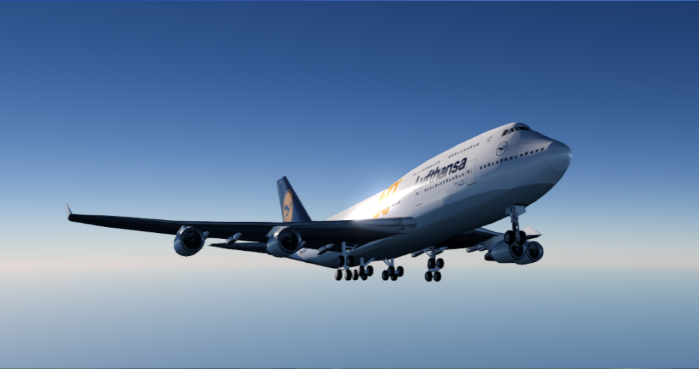

# Boeing 747-400

This is a project trying to do some serious improvements to the LincolnWorks-Flightgear/747-400.

Discord server link: <https://discord.gg/jZPuxwNmgw>.

## Variants

### Included

* 747-400 with General Electric CF6 engines
* 747-400 with Rolls-Royce RB211 engines
* 747-400 with Pratt & Whitney PW4000 engines

### In progress
* 747-400 Combi with General Electric CF6 engines
* 747-400ER with General Electric CF6 engines
* 747-400D (no winglets) with General Electric CF6 engines
* 747-400F with General Electric CF6 engines
* 747-400F with Pratt & Whitney PW4000 engines
* 747-400ERF with General Electric CF6 engines
* 747-400ERF with Pratt & Whitney PW4000 engines
* 747-400BCF with General Electric CF6 engines
* 747-400BCF with Rolls-Royce RB211 engines
* 747-400BCF with Pratt & Whitney PW4000 engines

## Currently being developed by

* [**Itmam Mahmud (aka Sadia2000/AVIONADE)**](https://github.com/Sadia2000) - Remodel of the Entire Cockpit.
* [**Mohamed Aissa (aka Uncle Aissa)**](https://github.com/mohamedaissa) - Enhancing Systems, Cockpit 3D Model and New Effects.
* [**SP-NTX (aka NTX)**](https://github.com/SP-NTX) - Enhancing Systems, Cockpit Textures, New UV Map, Paintkit and Liveries.
* [**Hornet (aka Hornet979)**](https://github.com/Hornet979) - Cockpit Textures, Effects and Reflections.
* [**sriemmanuel787**](https://github.com/sriemmanuel787) - Liveries, Paintkit and so on.

## Change-Log

* Improved base textures for the cockpit
* Make a new EFB and a new CDU
* Enhanced the Flaphandle and engine cutoff switches
* Added Autothrotte arm
* Added nightlight with switch controls (generic renderer is enough)
* Firewarning on the engine-cutoff and fire extinguishers
* Enhance Fire effect and give it smoke and extinguisher foam effects
* New Gear handle from the 757
* New Seats from the 757
* New Fire Warnings
* New Fire warning on EICAS
* Optimised the systems to be FPS friendly as possible
* New UV Map, New High Quality Paitkit and Liveries
* Much, much more!

For more detailed information, [visit](https://github.com/Sadia2000/747-400/wiki) the wiki page

## Installation

To fly this aircraft, one MUST have a minimum [FlightGear 2020.3](https://www.flightgear.org/download), but FlightGear 2020.4 is recommended.

1. Open Git Bash terminal and cd into the folder directory you would like to install your aircraft onto and make sure the aircraft folder directory is added in FlightGear's Add-ons menu
2. Type in `git clone https://github.com/Sadia2000/747-400.git`
3. If you would like to update the aircraft after a new update is released, change directory (cd) into the aircraft folder and `git pull`

### GitHub Download

1. Download the zip file by pressing code -> Download ZIP
2. Rename the unzipped folder to "747-400"
3. Unzip the file into your aircraft folder and make sure the aircraft folder directory is added in FlightGear's Add-ons menu
